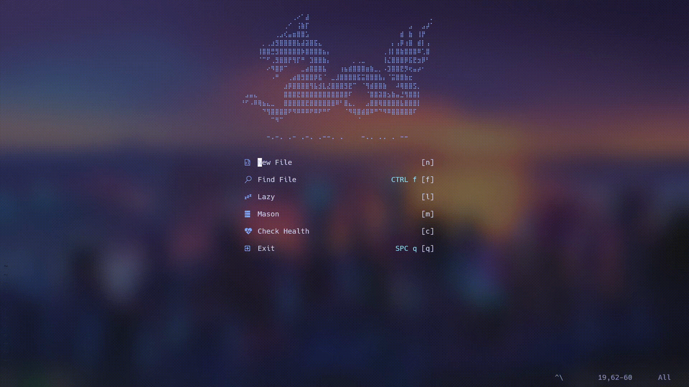
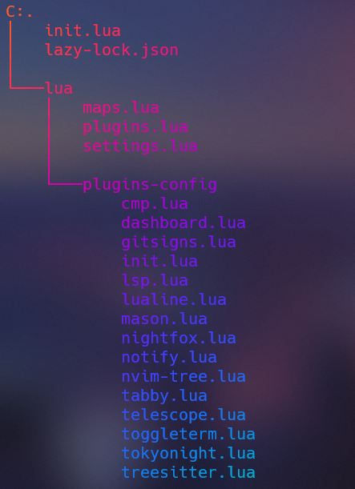
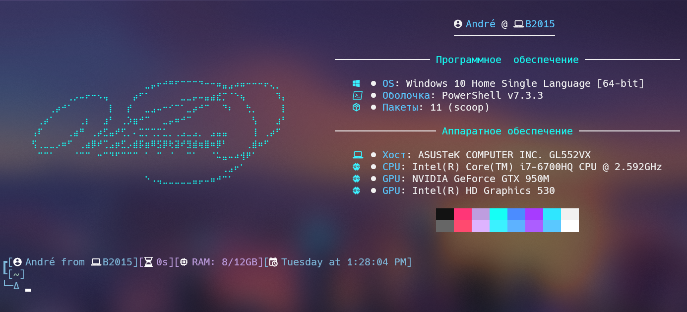

<pre style="background-image: linear-gradient(43deg, #4158D0 0%, #C850C0 46%, #FFCC70 100%); -webkit-background-clip: text; color: transparent;">              
   __    _  ___  _ __   ___    ___  __    _  __,
  ( /   /  ( /  ( /  ) ( / \  /  ()( /   /  (
   / / /    /    /  /   /  / /   /  / / /    `.
  (_/_/   _/_   /  (_ (/\_/ (___/  (_/_/   (___)
  ___    ___  ______ ______  ___   __   ______  __,
 ( / \  /  ()(  /   (  /    ( /   ( /  (  /    (
  /  / /   /   /     -/--    /     /     /--    `.
(/\_/ (___/  _/     _/     _/_   (/___/(/____/(___)
</pre>

---

<pre style="background-image: linear-gradient(43deg, #4158D0 0%, #C850C0 46%, #FFCC70 100%); -webkit-background-clip: text; color: transparent;">              
 +-+ +-+ +-+ +-+
 |N| |V| |I| |M|
 +-+ +-+ +-+ +-+
</pre>

<b>Plugins</b>

<ul>
    <li>Theme</li>
    <ul>
        <li><a href="https://github.com/folke/tokyonight.nvim">Tokyonight</a></li>
    </ul>
    <li>Interface</li>
    <ul>
        <li><a href="https://github.com/nvim-lualine/lualine.nvim">lualine</a></li>
        <li><a href="https://github.com/rcarriga/nvim-notify">nvim-notify</a></li>
        <li><a href="https://github.com/lukas-reineke/indent-blankline.nvim">indent-blankline.nvim</a></li>
        <li><a href="https://github.com/nvimdev/dashboard-nvim">dashboard-nvim</a></li>
        <li><a href="https://github.com/lewis6991/gitsigns.nvim">gitsigns.nvim</a></li>
    </ul>
    <li>Navigation</li>
    <ul>
        <li><a href="https://github.com/nanozuki/tabby.nvim">tabby.nvim</a></li>
        <li><a href="https://github.com/akinsho/toggleterm.nvim">toggleterm.nvim</a></li>
        <li><a href="https://github.com/nvim-neo-tree/neo-tree.nvim">neo-tree.nvim</a></li>
        <li><a href="https://github.com/nvim-telescope/telescope.nvim">telescope</a></li>
    </ul>
    <li>Functional</li>
    <ul>
        <li><a href="https://github.com/shoukoo/commentary.nvim">commentary.nvim</a></li>
        <li><a href="https://github.com/norcalli/nvim-colorizer.lua">nvim-colorizer.lua</a></li>
        <li><a href="https://github.com/nvim-treesitter/nvim-treesitter">nvim-treesitter</a></li>
        <li><a href="https://github.com/windwp/nvim-autopairs">nvim-autopairs</a></li>
        <li><a href="https://github.com/L3MON4D3/LuaSnip">LuaSnip</a></li>
        <li><a href="https://github.com/saadparwaiz1/cmp_luasnip">cmp-luasnip</a></li>
        <li><a href=https://github.com/hrsh7th/nvim-cmp">nvim-cmp</a></li>
        <li><a href="https://github.com/hrsh7th/cmp-nvim-lsp">cmp-nvim-slp</a></li>
        <li><a href="https://github.com/williamboman/mason.nvim">mason.nvim</a></li>
        <li><a href="https://github.com/neovim/nvim-lspconfig">nvim-lspconfig</a></li>
        <li><a href="https://github.com/williamboman/mason-lspconfig.nvim">mason-lspconfig.nvim</a></li>
        <li>glepnir/lspsaga.nvim</li>
    </ul>
</ul>

### Files Structure

> Rainbow effect in powershell thanks to [lolcat](https://github.com/andot/lolcat)

<pre style="background-image: linear-gradient(43deg, #4158D0 0%, #C850C0 46%, #FFCC70 100%); -webkit-background-clip: text; color: transparent;">              
 +-+ +-+ +-+ +-+ +-+ +-+ +-+ +-+
 |W| |I| |N| |F| |E| |T| |C| |H|
 +-+ +-+ +-+ +-+ +-+ +-+ +-+ +-+
</pre>

